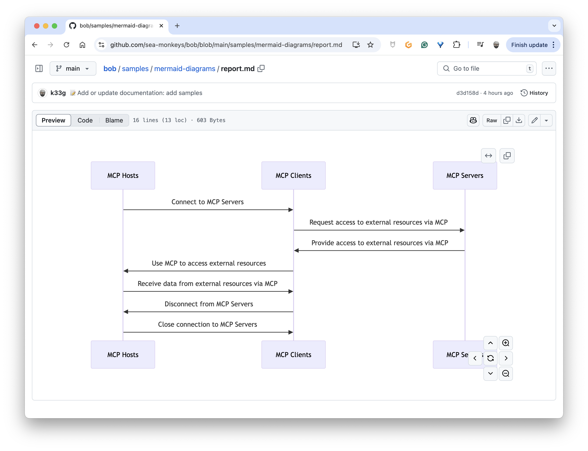
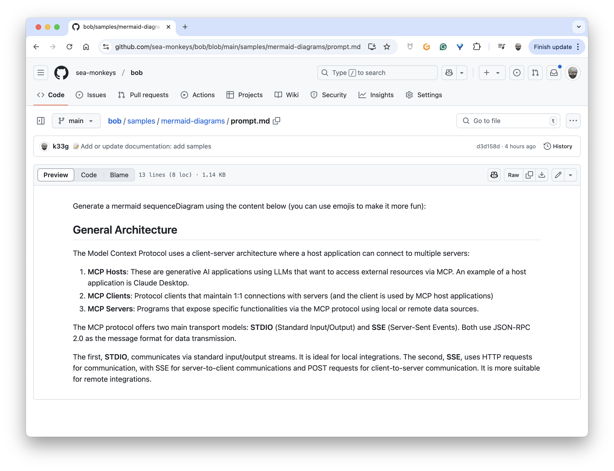
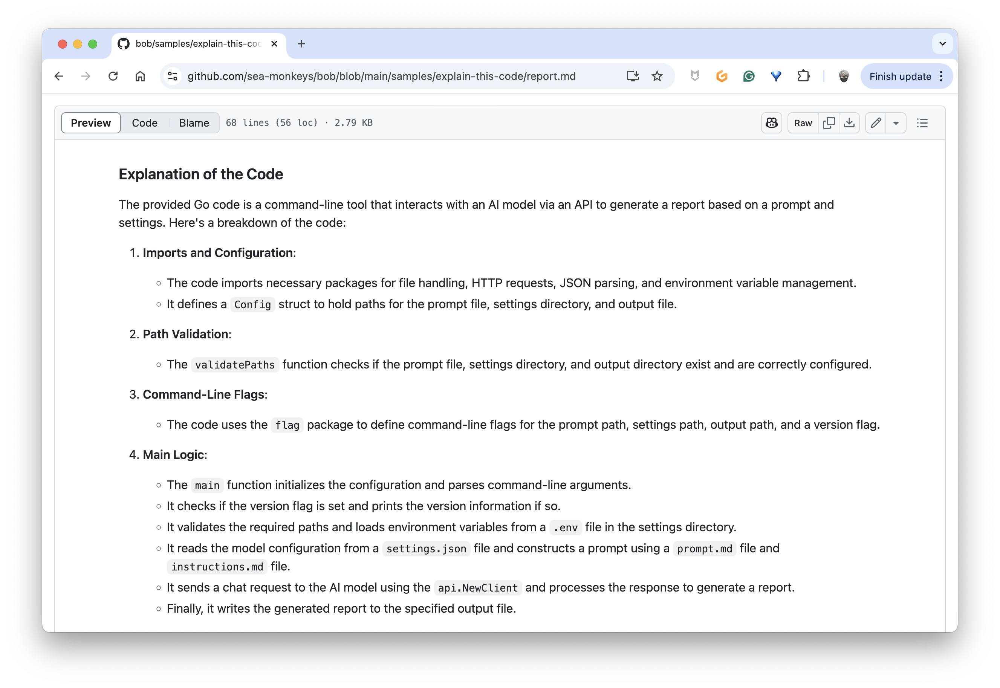
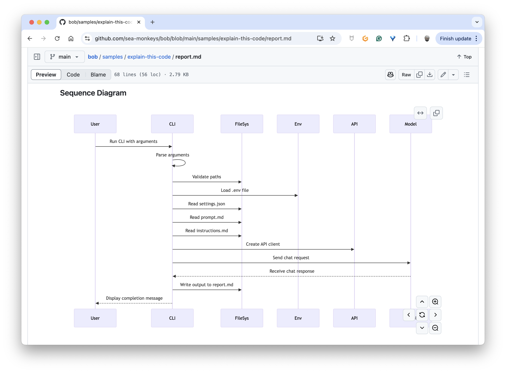
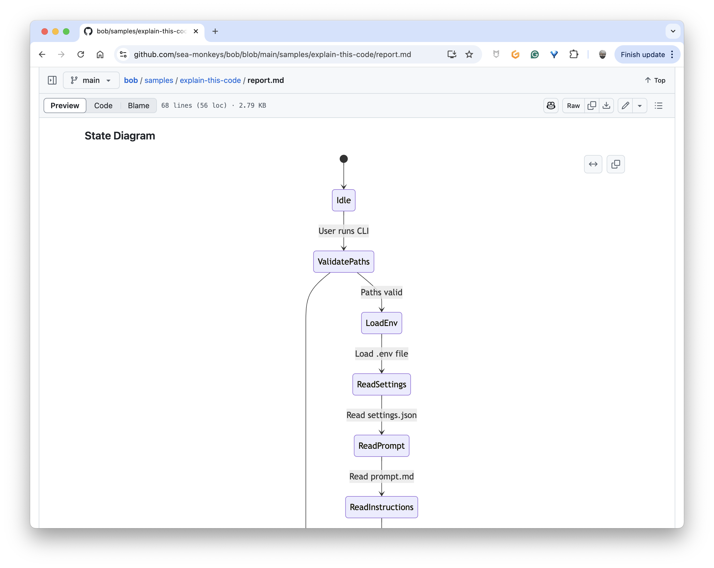
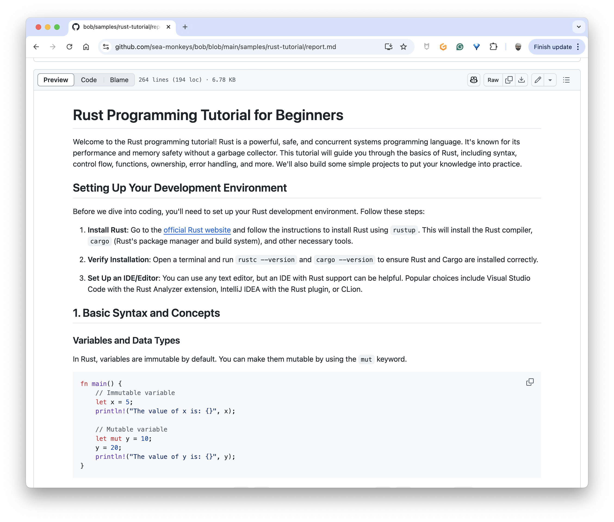
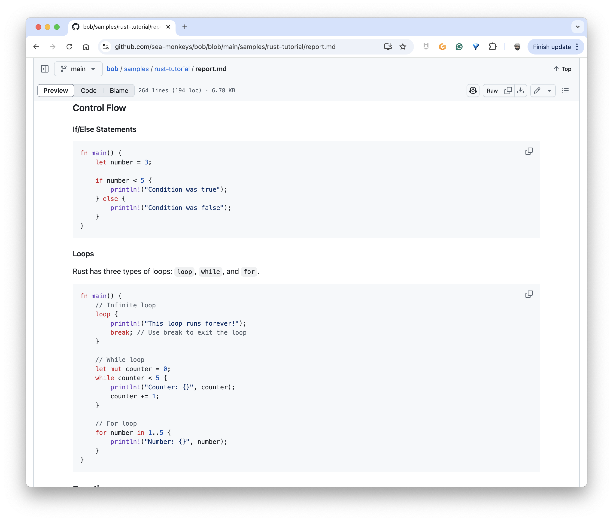
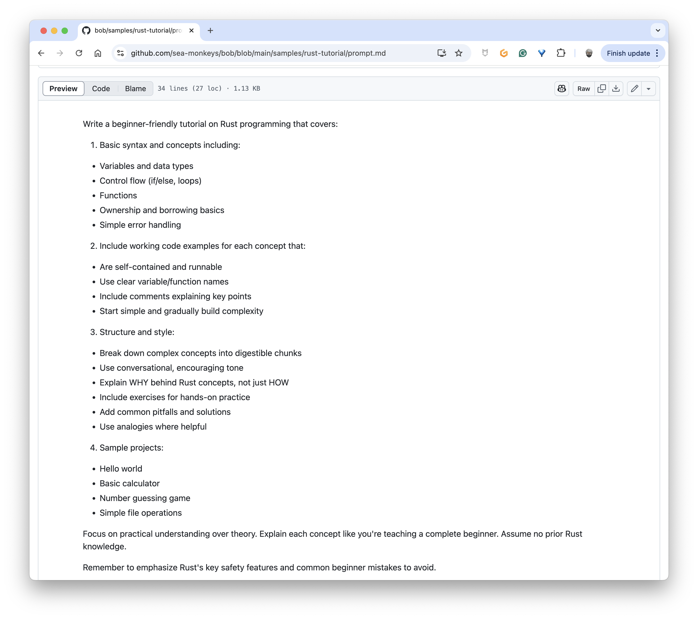

# Est-ce que ces petits LLMs sont vraiment utiles ?

Pour ce premier article de l'année 2025, je vais faire court et répondre à une question que l'on me pose souvent : "Est-ce que ces petits LLMs sont vraiment utiles ?"

La réponse courte est **oui**, bien sûr. 

Et je vais vous donner quelques exemples de mon utilisations personnelle de ces "tiny" modèles.

## Mon petit bout de code pour utiliser les "tiny" modèles

J'utilise tous les jours (et plusieurs fois par jour) ce bout de code (en Go) pour tester des LLMs avec Ollama, mais aussi pour m'aider à générer des contenus divers et variés :

```golang
package main

import (
	"context"
	"fmt"
	"log"
	"net/http"
	"net/url"
	"os"

	"github.com/ollama/ollama/api"
)

var (
	FALSE = false
	TRUE  = true
)

func main() {
	ctx := context.Background()

	var ollamaRawUrl string
	if ollamaRawUrl = os.Getenv("OLLAMA_HOST"); ollamaRawUrl == "" {
		ollamaRawUrl = "http://localhost:11434"
	}

	model := "qwen2.5-coder:1.5b"
	systemInstructions := "You are a useful AI agent."

	url, _ := url.Parse(ollamaRawUrl)

	client := api.NewClient(url, http.DefaultClient)

	// Load the content of the prompt.md file
	prompt, err := os.ReadFile("prompt.md")
	if err != nil {
		log.Fatalln("😡", err)
	}

	// Prompt construction
	messages := []api.Message{
		{Role: "system", Content: systemInstructions},
		{Role: "user", Content: string(prompt)},
	}

	req := &api.ChatRequest{
		Model:    model,
		Messages: messages,
		Options: map[string]interface{}{
			"temperature":   0.0,
			"repeat_last_n": 2,
		},
		Stream: &TRUE,
	}

	answer := ""
	err = client.Chat(ctx, req, func(resp api.ChatResponse) error {
		answer += resp.Message.Content
		fmt.Print(resp.Message.Content)
		return nil
	})

	if err != nil {
		log.Fatalln("😡", err)
	}

	// generate a markdown file from the value of answer
	err = os.WriteFile("report.md", []byte(answer), 0644)
	if err != nil {
		log.Fatalln("😡", err)
	}
}
```

### Mais que fait ce code ?

Ce programme Go utilise et profite de la puissance de l'API d'Ollama pour générer du contenu à partir d'un prompt envoyé à un LLM local.

#### Étapes principales

1. **Configuration**
   - Connection à Ollama (par défaut: localhost:11434)
   - Utilisation du modèle Qwen 2.5 Coder (dans cet exemple, mais je change souvent de modèle)

2. **Traitement**
   - Lecture du fichier `prompt.md`, c'est dans ce fichier que je vais poser ma question.
   - Construction du message avec les instructions système (dans cet exemple, "You are a useful AI agent.")
   - Envoi à l'API avec diverses options (ici, par exemple température à `0.0`)

3. **Sortie**
   - Affichage en temps réel de la réponse
   - Sauvegarde de la réponse dans le fichier `report.md`

## Exemples d'utilisation

Je me sers de ce bout de code pour générer des contenus divers et variés, comme par exemple :

### Des diagrammes à partir d'une simple explication

J'ai utilisé ce LLM : [qwen2.5-coder:1.5b](https://ollama.com/library/qwen2.5-coder:1.5b) pour générer un diagramme à partir d'une simple explication.

#### Diagramme


#### Le prompt associé



###  Des explications de code source avec des diagrammes associés

J'ai utilisé ce LLM : [qwen2.5-coder:14b](https://ollama.com/library/qwen2.5-coder:14b) pour générer une explication de code source et des diagrammes.

#### Résultat








### Un tutorial Rust pour débutants

J'ai utilisé ce LLM : [qwen2.5-coder:14b](https://ollama.com/library/qwen2.5-coder:14b) pour générer ce tutorial sur Rust.

#### Résultat





#### Le prompt associé



Vous voyez, c'est vraiment utile ! Cela fonctionne en local sur ma machine sans Claude.ai, Gemini ou ChatGPT. Je l'utilise même pour générer des scénarios de jeu de rôle, des recettes de cuisine, etc.

Et dernier point, mais non des moindres, je me suis décidé pour ce premier jour de 2025 à faire de ce bout de code une CLI pour que je puisse l'utiliser encore plus facilement. C'est donc mon premier side project de l'année que vous pouvez retrouver ici : [https://github.com/sea-monkeys/bob](https://github.com/sea-monkeys/bob).

Amusez vous bien et à très bientôt pour de nouvelles aventures avec les LLMs !


