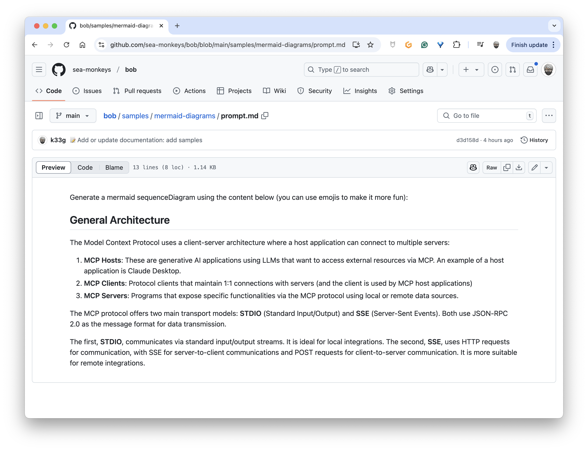
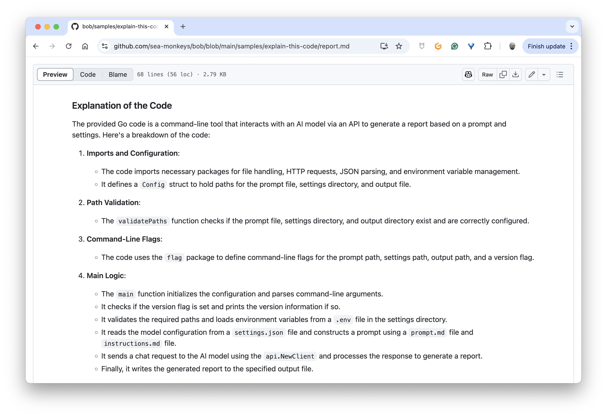
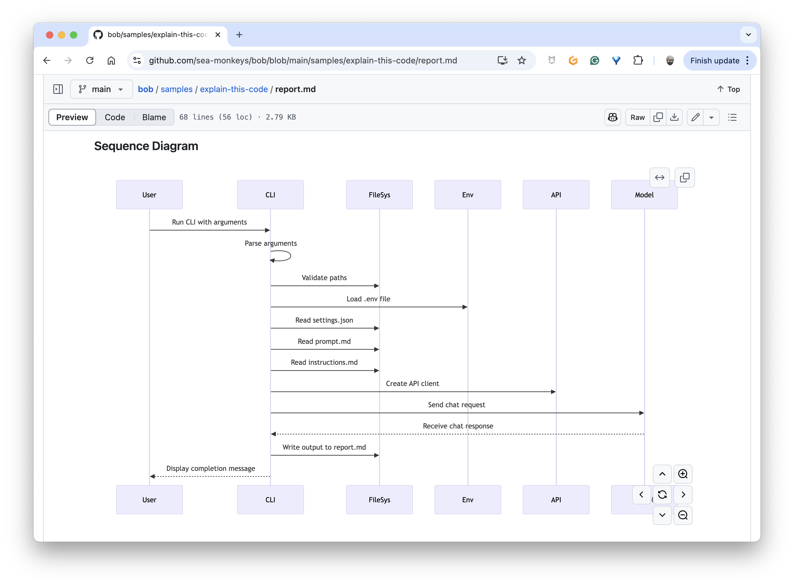
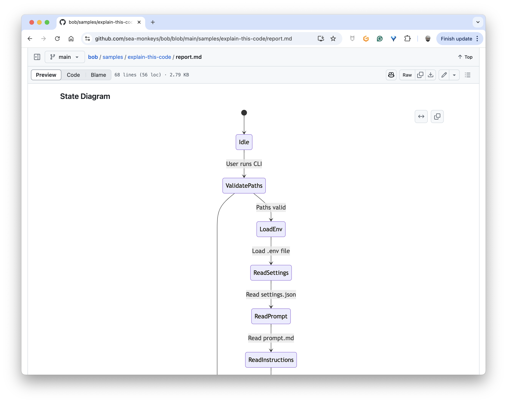
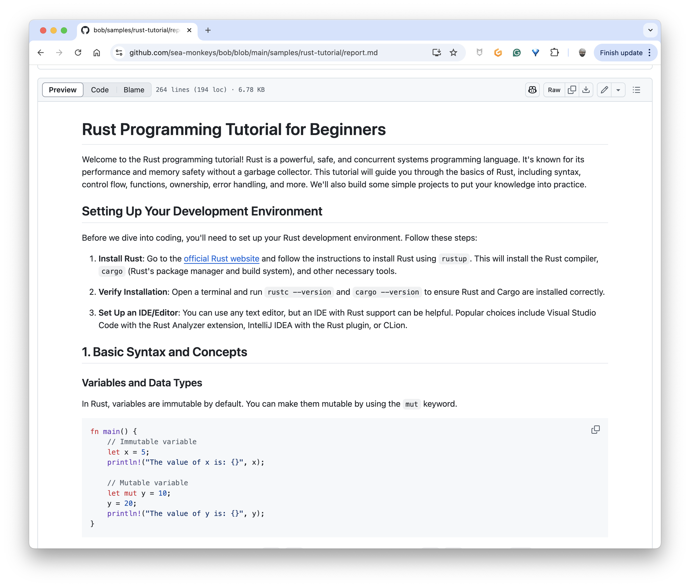

# Are these small LLMs really useful?

For this first article of 2025, I'll keep it short and answer a question I'm often asked: "Are these small LLMs really useful?"

The short answer is **yes**, of course.

And I'll give you some examples of my personal use of these "tiny" models.

## My small code snippet for using "tiny" models

I use this piece of code (in Go) every day (and several times a day) to test LLMs with Ollama, but also to help me generate various types of content:

```golang
package main

import (
    "context"
    "fmt"
    "log"
    "net/http"
    "net/url"
    "os"

    "github.com/ollama/ollama/api"
)

var (
    FALSE = false
    TRUE  = true
)

func main() {
    ctx := context.Background()

    var ollamaRawUrl string
    if ollamaRawUrl = os.Getenv("OLLAMA_HOST"); ollamaRawUrl == "" {
        ollamaRawUrl = "http://localhost:11434"
    }

    model := "qwen2.5-coder:1.5b"
    systemInstructions := "You are a useful AI agent."

    url, _ := url.Parse(ollamaRawUrl)

    client := api.NewClient(url, http.DefaultClient)

    // Load the content of the prompt.md file
    prompt, err := os.ReadFile("prompt.md")
    if err != nil {
        log.Fatalln("😡", err)
    }

    // Prompt construction
    messages := []api.Message{
        {Role: "system", Content: systemInstructions},
        {Role: "user", Content: string(prompt)},
    }

    req := &api.ChatRequest{
        Model:    model,
        Messages: messages,
        Options: map[string]interface{}{
            "temperature":   0.0,
            "repeat_last_n": 2,
        },
        Stream: &TRUE,
    }

    answer := ""
    err = client.Chat(ctx, req, func(resp api.ChatResponse) error {
        answer += resp.Message.Content
        fmt.Print(resp.Message.Content)
        return nil
    })

    if err != nil {
        log.Fatalln("😡", err)
    }

    // generate a markdown file from the value of answer
    err = os.WriteFile("report.md", []byte(answer), 0644)
    if err != nil {
        log.Fatalln("😡", err)
    }
}
```

### But what does this code do?

This Go program uses and leverages the power of the Ollama API to generate content from a prompt sent to a local LLM.

#### Main steps

1. **Configuration**
   - Connection to Ollama (default: localhost:11434)
   - Using the Qwen 2.5 Coder model (in this example, but I often change models)

2. **Processing**
   - Reading the `prompt.md` file, this is where I'll put my question
   - Building the message with system instructions (in this example, "You are a useful AI agent.")
   - Sending to the API with various options (here, for example, temperature at `0.0`)

3. **Output**
   - Real-time display of the response
   - Saving the response in the `report.md` file

## Usage Examples

I use this code snippet to generate various types of content, such as:

### Diagrams from a simple explanation

I used this LLM: [qwen2.5-coder:1.5b](https://ollama.com/library/qwen2.5-coder:1.5b) to generate a diagram from a simple explanation.

#### Diagram


#### Associated prompt



### Source code explanations with associated diagrams

I used this LLM: [qwen2.5-coder:14b](https://ollama.com/library/qwen2.5-coder:14b) to generate source code explanation and diagrams.

#### Result







### A Rust tutorial for beginners

I used this LLM: [qwen2.5-coder:14b](https://ollama.com/library/qwen2.5-coder:14b) to generate this Rust tutorial.

#### Result




#### Associated prompt


You see, it's really useful! It works locally on my machine without Claude.ai, Gemini, or ChatGPT. I even use it to generate role-playing game scenarios, recipes, etc.

And last but not least, I decided on this first day of 2025 to turn this piece of code into a CLI so I could use it even more easily. So this is my first side project of the year, which you can find here: [https://github.com/sea-monkeys/bob](https://github.com/sea-monkeys/bob).

Have fun and see you soon for new adventures with LLMs!